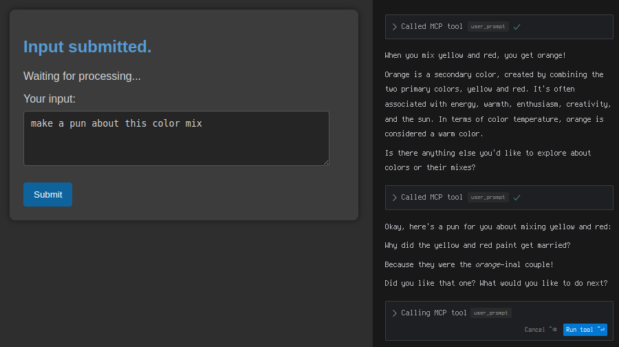

# User Prompt MCP



## Overview

This project implements an MCP server that allows Cursor (or any MCP-compatible client) to request additional input from users during model generation without ending the generation process. It serves as a bridge between the AI model and the user, creating a more interactive experience.

## Features

- **User Input Prompting**: Allows the AI to ask for more information during generation
- **Simple GUI**: Presents input prompts in a dialog box with text wrapping
- **Cross-Platform**: Windows, Linux, macOS
- **Stdio Transport**: Integration with Cursor via stdio

## Installation

### Prerequisites

Install Vibeframe: https://www.vibeframe.dev/

### Quick Install (Recommended)

The easiest way to install is using our installation script, which automatically downloads the appropriate binary for your system.

By default, the script installs both the `user-prompt-mcp` client and the `user-prompt-server`. You can specify which component to install using the `--component` flag.

```bash
# Install the latest version
curl -sSL https://raw.githubusercontent.com/nazar256/user-prompt-mcp/main/install.sh | bash

# Or install a specific version
curl -sSL https://raw.githubusercontent.com/nazar256/user-prompt-mcp/main/install.sh | bash -s -- -v v1.0.0

# Install the latest version of the client (user-prompt-mcp) only
curl -sSL https://raw.githubusercontent.com/nazar256/user-prompt-mcp/main/install.sh | bash -s -- --component client

# Install the latest version of the server (user-prompt-server) only
curl -sSL https://raw.githubusercontent.com/nazar256/user-prompt-mcp/main/install.sh | bash -s -- --component server

# Install a specific version of the client only
curl -sSL https://raw.githubusercontent.com/nazar256/user-prompt-mcp/main/install.sh | bash -s -- --component client -v v1.0.0
```

The installation script will:
- Detect your OS and architecture (Linux or macOS, amd64 or arm64)
- Download the appropriate pre-compiled binary
- Install it to a suitable directory in your PATH
- Make it executable

### Install from source

If you prefer to build from source (requires Go 1.18+):

```bash
go install github.com/nazar256/user-prompt-mcp/cmd/user-prompt-mcp@latest
go install github.com/nazar256/user-prompt-mcp/cmd/user-prompt-server@latest
```

### Manual Installation

You can also download pre-compiled binaries directly from the [Releases page](https://github.com/nazar256/user-prompt-mcp/releases).

## Usage with Cursor

1. Ensure `user-prompt-mcp` is in your PATH
2. Run `user-prompt-server` in a terminal
3. File -> Preferences -> Cursor Settings -> MCP Servers
4. Add a new server with a name like 'input user prompt'
5. Type: command
6. Command is `user-prompt-mcp`
7. Save
8. Add to global rules something like: "Important - do not finish responding until explicitly told to do so, instead always use MCP `user_prompt` and wait for response in all cases, either you feel stuck, you have question or you finished work on a prompt - always communicate with the user using this MCP."
9. Restart Cursor
10. Ctrl+Shift+P -> Vibeframe: Open Vibeframe Panel

### Configuration

The client (`user-prompt-mcp`) and the UI server (`user-prompt-server`) can be configured using command-line flags.

#### Timeout Configuration (for `user-prompt-mcp` client)
By default, the `user-prompt-mcp` client will wait 20 minutes for user input via the UI server before timing out. You can customize this timeout for the client using:

- Command line flag: `--timeout <seconds>`
  ```bash
  user-prompt-mcp --timeout 600  # Set client-side timeout to 10 minutes
  ```
- Environment variable: `USER_PROMPT_TIMEOUT=<seconds>` (This environment variable is read by `pkg/prompt/service.go` if no command-line timeout is provided to `user-prompt-mcp` client. However, direct command-line flags are generally more explicit for client configuration.)
  ```bash
  # Example for how the underlying service might pick it up if not overridden by client's flag
  export USER_PROMPT_TIMEOUT=1800 
  user-prompt-mcp 
  ```

#### Server Connection Configuration

**`user-prompt-server` (UI Server):**

This is the server that provides the web UI for input.
- To change the port it listens on (default is `3030`):
  ```bash
  user-prompt-server --port <port_number>
  # Example: Run the UI server on port 4000 (HTTP)
  user-prompt-server --port 4000
  ```
- To run the server with HTTPS, provide paths to your TLS certificate and key files:
  ```bash
  user-prompt-server --port <port_number> --tls-cert-file /path/to/cert.pem --tls-key-file /path/to/key.pem
  # Example: Run the UI server on port 443 (HTTPS)
  user-prompt-server --port 443 --tls-cert-file ./server.crt --tls-key-file ./server.key
  ```
  If `--tls-cert-file` and `--tls-key-file` are provided, the server will run in HTTPS mode. Otherwise, it defaults to HTTP.
  You are responsible for obtaining and managing your SSL/TLS certificates.

**`user-prompt-mcp` (Client used by Cursor):**

This is the client that Cursor interacts with. It needs to know where the `user-prompt-server` is running.
- To specify the URL of the `user-prompt-server` (default is `http://localhost:3030`):
  ```bash
  user-prompt-mcp --prompt-server-url <full_url>
  # Example: Connect to an HTTP UI server running on port 4000 on the same machine
  user-prompt-mcp --prompt-server-url http://localhost:4000
  # Example: Connect to an HTTPS UI server running on port 443 on the same machine
  user-prompt-mcp --prompt-server-url https://localhost:443
  # Example: Connect to a UI server running on a different machine (HTTP or HTTPS)
  user-prompt-mcp --prompt-server-url http://192.168.1.100:3030
  user-prompt-mcp --prompt-server-url https://my-secure-server.example.com:443
  ```

## Current Limitations

- Timeout in Cursor doesn't seem to work, it may be a limitation of Cursor.

## Troubleshooting

If you encounter issues with prompts not appearing:
1.  **Ensure `user-prompt-server` is running**: This server is responsible for the Vibeframe UI. It's typically started separately.
2.  **Check `user-prompt-mcp` configuration**: Ensure `user-prompt-mcp` (the client running with Cursor) is configured with the correct URL for the `user-prompt-server` (default is `http://localhost:3030`).
3.  **Check Logs**: Review the standard output/error streams for `user-prompt-mcp` (client) and `user-prompt-server` (Vibeframe UI) for any connection errors or other issues.
4.  **Browser Console**: If the Vibeframe UI loads but prompts don't appear or work correctly, check the browser's developer console for JavaScript errors or network issues related to SSE (Server-Sent Events) on the `/events` endpoint or submissions to `/submit-input`.

## License

MIT

## Acknowledgements

- [Model Context Protocol](https://modelcontextprotocol.io)
- [mark3labs/mcp-go](https://github.com/mark3labs/mcp-go) 
- [taggartbg/vibeframe](https://github.com/taggartbg/vibeframe)